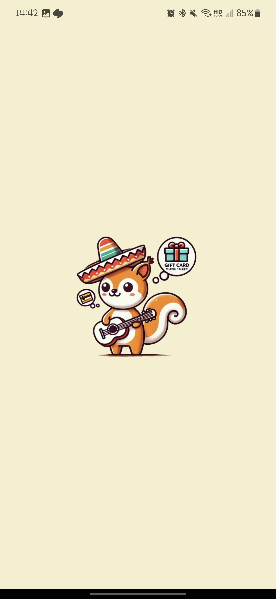
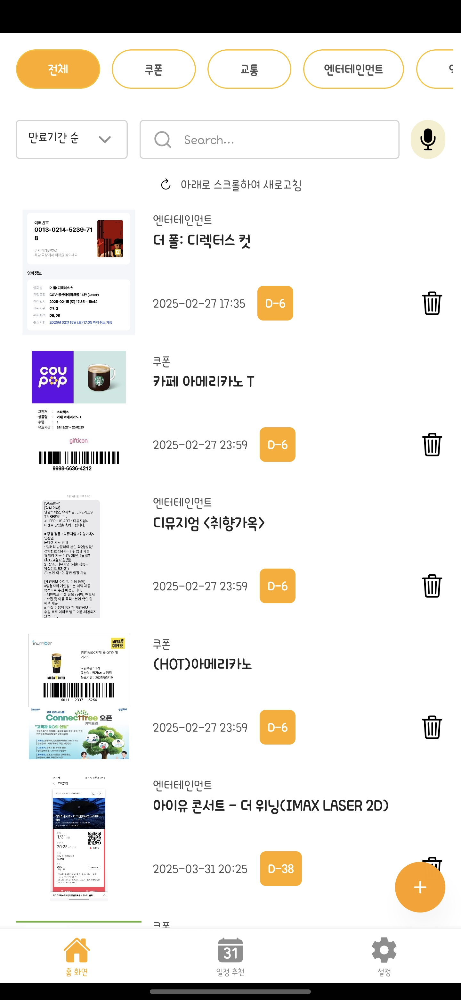
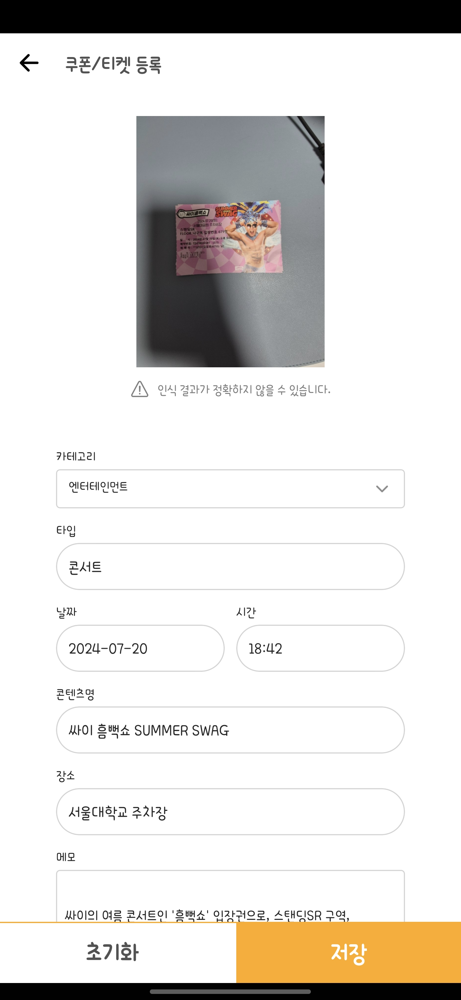

# Rememberme-Back

[frontend repo](https://github.com/cocorememberme/frontend)

## api
[api doc](https://cocorememberme.azurewebsites.net/docs)

## 실행 방법.

```bash
python3 -m venv venv
source venv/bin/activate
pip install -r requirements.txt
python main.py
```

## 스택

- python3.12
- FastAPI
- SqlAlchemy
- MySQL

- Azure Web App
- Azure Storage Blob
- Azure Open AI

- FCM

# 실행 화면




